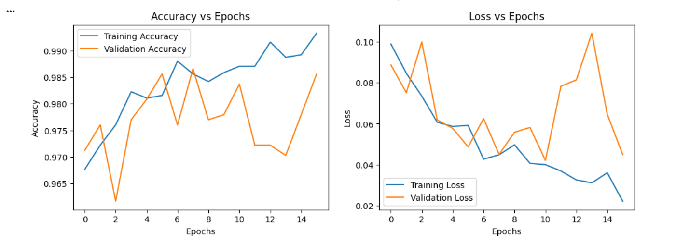
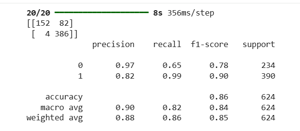

# Pneumonia Detection from Chest X-Ray Images Using CNN and Transfer Learning

## Overview

This project develops a deep learning-based system for automated pneumonia detection from chest X-ray images.

A Convolutional Neural Network (CNN) with transfer learning is used to classify chest X-ray images into two categories:

- Normal
- Pneumonia

The project uses a pretrained VGG16 architecture as the convolutional backbone and a custom classification head for binary classification. Transfer learning and selective fine-tuning are applied to adapt the pretrained model to the medical imaging task.

The main focus is on achieving high recall for pneumonia cases, since minimizing false-negative predictions is particularly important in a medical screening context.

---

## Problem Statement

Pneumonia is a serious respiratory infection that can be identified using chest X-ray imaging. However, interpreting chest radiographs requires specialised expertise and can be affected by subtle visual patterns and variability between cases.

This project investigates whether deep learning and transfer learning can be used to automatically classify chest X-ray images as Normal or Pneumonia.

The system is intended as an academic decision-support approach and is not designed to replace professional medical diagnosis.

---

## Objectives

- Develop a CNN-based binary image classification model for pneumonia detection.
- Apply transfer learning using the pretrained VGG16 architecture.
- Preprocess and normalize chest X-ray images for deep learning.
- Apply data augmentation to improve model generalisation.
- Address class imbalance using class weighting.
- Fine-tune higher-level VGG16 convolutional layers.
- Evaluate the model using accuracy, precision, recall, F1-score, and confusion matrix.
- Prioritize high recall for pneumonia cases to reduce false-negative predictions.

---

## Dataset

The project uses the publicly available Kaggle Chest X-Ray Pneumonia dataset.

The dataset contains paediatric chest X-ray images categorized into:

- Normal
- Pneumonia

The dataset is imbalanced, with pneumonia images representing the majority class.

### Dataset Distribution

| Class | Images | Percentage |
|---|---:|---:|
| Normal | 1,583 | 27% |
| Pneumonia | 4,273 | 73% |

The independent test set contains 624 images.

### Image Characteristics

- Modality: Chest X-ray
- Original format: JPEG
- Original images: Grayscale
- Model input: 224 × 224 × 3
- Classification type: Binary classification

---

## Methodology

The project follows a transfer learning-based workflow consisting of five major stages:

1. Data preprocessing
2. Transfer learning-based feature extraction
3. Custom classifier construction
4. Fine-tuning and regularisation
5. Model evaluation

The workflow begins with standardized chest X-ray images. These images are passed through the pretrained VGG16 convolutional backbone to extract high-level visual features.

The extracted features are then passed to a custom classification head, which produces the final probability for the pneumonia class.

---

## Data Preprocessing

The chest X-ray images are preprocessed before being provided to the model.

The preprocessing pipeline includes:

- Resizing images to 224 × 224 pixels
- Converting grayscale images to three channels for VGG16 compatibility
- Pixel normalization using a rescaling factor of 1/255
- Data augmentation applied to training images

### Data Augmentation

Training images are augmented using transformations such as:

- Rotation
- Zoom
- Horizontal flipping
- Width and height shifting

These transformations increase training-data diversity and help improve model generalisation.

---

## Transfer Learning

VGG16 is used as the pretrained convolutional backbone.

The model was originally trained on ImageNet and is used here to reuse learned visual features for the pneumonia classification task.

Transfer learning was selected because the medical dataset is relatively limited compared with the large datasets normally required to train deep CNNs from scratch.

---

## Model Architecture

The VGG16 convolutional base is followed by a custom classification head:

VGG16 Convolutional Base  
↓  
Flatten  
↓  
Dense Layer — 256 units, ReLU  
↓  
Batch Normalization  
↓  
Dropout  
↓  
Dense Layer — 1 unit, Sigmoid  
↓  
Binary Prediction

The VGG16 convolutional base performs feature extraction, while the custom classification head performs the final binary classification between Normal and Pneumonia.

---

## Training Strategy

The model uses a two-phase transfer learning strategy.

### Phase 1 — Feature Extraction

The pretrained VGG16 convolutional layers are frozen while the custom classification head is trained.

Training configuration includes:

- Learning rate: 0.001
- Loss function: Binary Cross-Entropy
- Optimizer: Adam

The purpose of this phase is to train the task-specific classifier without modifying the pretrained convolutional filters.

### Phase 2 — Fine-Tuning

The last few convolutional layers of VGG16 are unfrozen and fine-tuned.

Fine-tuning configuration includes:

- Learning rate: 1e-5
- Training: Up to 30 epochs
- Early stopping

The purpose of fine-tuning is to adapt higher-level visual features to pneumonia-specific radiographic patterns.

---

## Handling Class Imbalance

The dataset contains substantially more pneumonia images than normal images.

This imbalance can cause the classifier to favour the majority class.

To address this issue, the project uses:

- Class weighting
- Data augmentation
- Precision, recall, and F1-score in addition to accuracy

Recall is particularly important for pneumonia detection because false-negative predictions can be more critical than false-positive predictions in a screening scenario.

---

## Evaluation Metrics

The model is evaluated using:

- Accuracy
- Precision
- Recall
- F1-score
- Confusion Matrix

These metrics provide a more complete assessment than accuracy alone, especially because the dataset is imbalanced.

---

## Results

The recorded test evaluation achieved:

| Metric | Result |
|---|---:|
| Test Accuracy | 86.22% |
| Precision — Normal | 0.97 |
| Recall — Normal | 0.65 |
| F1-score — Normal | 0.78 |
| Precision — Pneumonia | 0.82 |
| Recall — Pneumonia | 0.99 |
| F1-score — Pneumonia | 0.90 |
| Macro F1-score | 0.84 |
| Weighted F1-score | 0.85 |

The model achieved a very high recall of approximately 0.99 for the Pneumonia class.

This indicates that the model detected the large majority of pneumonia cases in the test set, although some Normal cases were incorrectly classified as Pneumonia.

---

## Training Performance

During training, the model achieved approximately 98–99% training accuracy.

Validation accuracy fluctuated during training because the validation set was very small.

The training and validation loss curves showed overall convergence, although a generalisation gap between training and test performance remained.

---

## Classification Report

The final classification report shows strong pneumonia detection performance, particularly in terms of recall.

---

## Test Accuracy

The recorded test evaluation produced an accuracy of approximately 86.22%.

---

## Key Findings

- VGG16 transfer learning was effective for the pneumonia classification task.
- The recorded test accuracy was 86.22%.
- Pneumonia recall reached 0.99.
- The model produced very few false-negative pneumonia predictions.
- Some Normal images were incorrectly classified as Pneumonia.
- Class weighting helped address the imbalance between the two classes.
- Fine-tuning allowed the pretrained VGG16 features to adapt to the chest X-ray classification task.
- The model demonstrated strong sensitivity toward pneumonia cases.

---

## Implementation Challenges

The main challenges encountered during implementation were:

1. Validation accuracy instability due to the very small validation set.
2. Class imbalance affecting classification performance.
3. Learning-rate sensitivity during fine-tuning.
4. GPU memory management.

These challenges were addressed using class weighting, data augmentation, early stopping, dropout regularisation, and a reduced learning rate during fine-tuning.

---

## Limitations

- The validation set is very small, which limits the reliability of validation metrics.
- The dataset is imbalanced toward pneumonia cases.
- The dataset represents a paediatric population.
- The dataset originates from a limited medical source.
- The model performs binary classification only.
- Generalisation to other hospitals and patient populations has not been established.
- The model has not undergone clinical validation.

---

## Clinical Relevance

The proposed system could potentially support:

- Early pneumonia screening
- Radiologist decision support
- Reduction of diagnostic workload
- Screening in resource-constrained healthcare environments

However, the model is intended as a decision-support approach and not as a replacement for qualified medical professionals.

---

## Technologies Used

- Python
- TensorFlow
- Keras
- VGG16
- Convolutional Neural Networks (CNN)
- Transfer Learning
- NumPy
- Pandas
- Matplotlib
- Scikit-learn
- Jupyter Notebook

---

## Project Structure

Pneumonia-Detection-CNN/

├── images/
│   ├── Training_Results.png
│   ├── classification_report.png
│   └── test_accuracy.png
│
├── notebooks/
│   └── Pneumonia_Detection.ipynb
│
├── reports/
│   └── Pneumonia Detection Using CNN & TL.pdf
│
├── .gitignore
├── LICENSE
├── README.md
└── requirements.txt

---

## How to Run

### 1. Clone the Repository

`git clone https://github.com/samyupolice/Pneumonia-Detection-CNN.git`

`cd Pneumonia-Detection-CNN`

### 2. Install Dependencies

`pip install -r requirements.txt`

### 3. Open the Jupyter Notebook

Open:

`notebooks/Pneumonia_Detection.ipynb`

Run the notebook cells to reproduce the preprocessing, model training, evaluation, and analysis.

---

## Future Improvements

- Train the model using larger and more diverse chest X-ray datasets.
- Increase the size of the validation set.
- Compare VGG16 with other transfer-learning architectures such as ResNet and EfficientNet.
- Apply explainability techniques such as Grad-CAM.
- Evaluate the model on external datasets from different healthcare institutions.
- Improve generalisation across different patient populations.
- Explore multi-class classification.
- Further optimize the model for potential clinical decision-support applications.

---

## Academic Report

A detailed academic report covering the theoretical background, dataset, methodology, implementation, experimental results, limitations, discussion, and conclusion is available in the `reports/` folder.

---

## Conclusion

This project demonstrates the application of transfer learning and convolutional neural networks for automated pneumonia detection from chest X-ray images.

Using VGG16 as a pretrained feature extractor with a custom classification head and selective fine-tuning, the model achieved 86.22% accuracy on the recorded test evaluation and approximately 0.99 recall for pneumonia.

The results demonstrate the potential of transfer learning for medical image classification while also highlighting the importance of class imbalance, validation-set size, and external validation.

---

## Disclaimer

This project was developed for academic and research purposes.

The model is not a clinically validated medical diagnostic system and should not be used as a substitute for professional medical diagnosis.
